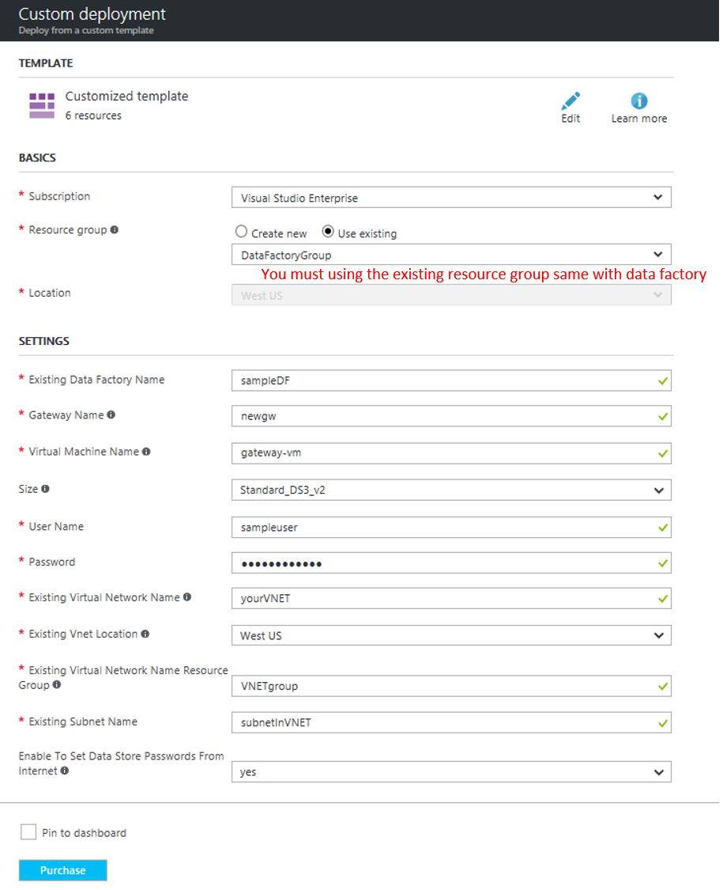

# Create a virtual machine with data management gateway installed

<a href="https://portal.azure.com/#create/Microsoft.Template/uri/https%3A%2F%2Fraw.githubusercontent.com%2FxiaoyingLJ%2Fvm-with-data-management-gateway%2Fmaster%2Fazuredeploy.json" target="_blank">
    
</a>
<a href="http://armviz.io/#/?load=https%3A%2F%2Fraw.githubusercontent.com%2FxiaoyingLJ%2Fvm-with-data-management-gateway%2Fmaster%2Fazuredeploy.json" target="_blank">
    
</a>

## Description
- This template creates a Virtual Machine, installs and registers the latest version of Data Management Gateway on it. 
- The Virtual machine can be added to an existing VNET, in case you already have a DB server installed within a VNET on an IaaS VM. Or you can create a new VNET. 

### Note
This template will create an addtional storage account for string Virtual Machine's system image. To avoid running into storage account limits, it is a good practice to delete the storage account when the VM is deleted. 

## Prerequisites

- Name of existing data factory.
- Name of the Resource Group that the data factory resides in(This template must be in this resource group)
- Name of the existing VNET and subnet you want to connect the new virtual machine to.
- Name of the Resource Group that the VNET resides in.
- Region of the VNET(VM will be created in the same region with VNET)

```


## Screenshot


